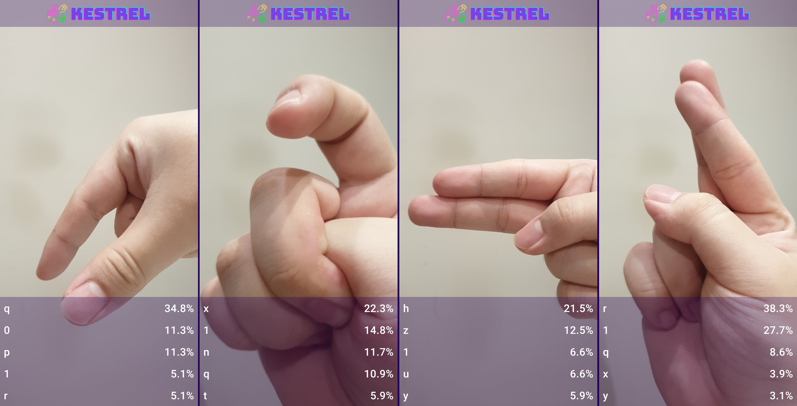
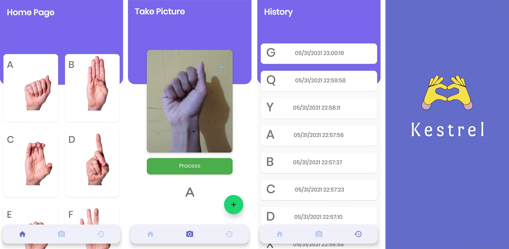
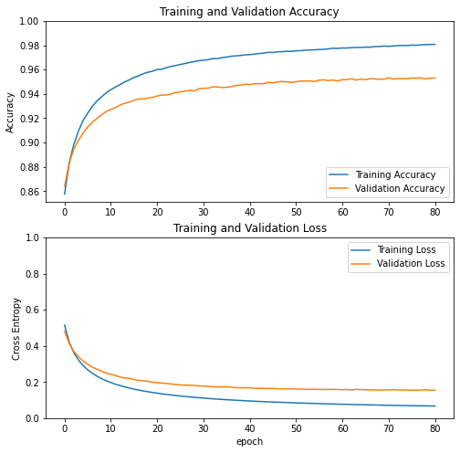

# Kestrel
### A [Bangkit 2021](https://grow.google/intl/id_id/bangkit/) Capstone Project

Kestrel is a TensorFlow-powered American Sign Language fingerspelling translator Android app that serves as a convenient way to learn and understand fingerspelling signs. The Kestrel model builds upon the state of the art [MobileNetV2](https://arxiv.org/abs/1801.04381) model that is optimized for speed and latency on mobile devices to accurately recognize and interpret sign language from the phone’s camera with a 96.8% testing accuracy (99.60% training accuracy, 98.66% validation accuracy) and display its translation through a beautiful, convenient and easily accessible Android app. 

## Thesis Research [v2.0]
Kestrel is now a part of my thesis research. The app is updated with:

1.  A brand new simplified user interface that instantly shows the viewfinder's live view and the top 5 fingerspelling results.
2.  A new MobileNetV2 model trained on a new dataset, with 50% more detection categories (36 labels containing 26 alphabets and ten numbers).

### Now available on Google Play

### Updated User Interface

## Bangkit [v1.0-alpha] 
The Kestrel model (95.2% testing accuracy, 98.16% training accuracy and 95.3% validation accuracy) is trained on 65.574 color images (comprising 24 static alphabet signs) from the [American Sign Language FingerSpelling Dataset](https://ieeexplore.ieee.org/document/6130290) published by Nicolas Pugeault and Richard Bowden on the 2011 IEEE International Conference on Computer Vision Workshops. 

### User Interface

### Accuracy and Loss Graph

### Colab

Google Play and the Google Play logo are trademarks of Google LLC.
